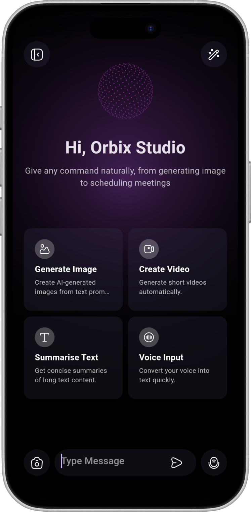
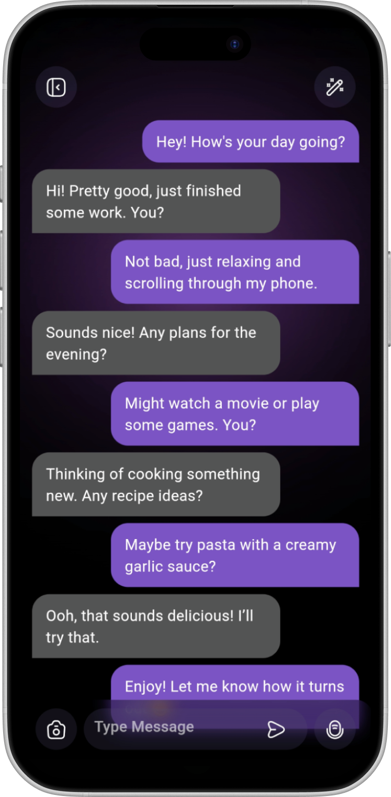
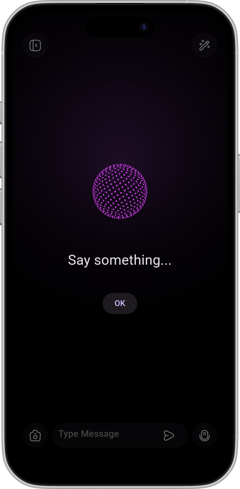

# 🤖 AI Chatbot UI – Flutter

A **Flutter-based UI** project for a modern AI Chatbot app, inspired by this [Dribbble design](https://dribbble.com/shots/26506252-AI-Assistant-App-Design-Conversational-and-Creative-AI).  

⚠️ **Note:** This is a **UI-only project**. It demonstrates a clean, interactive interface for an AI chat app, but **does not include AI functionality**.

---

## ✨ Features

- **💬 Conversational Chat UI**  
  Smooth and modern chat bubbles for user and AI messages.

- **🏠 Welcome / Feature Page**  
  - Friendly welcome message.  
  - Highlights key app features (like conversational AI, creative assistance, and productivity tools).

- **🗣 Speech-to-Text Input**  
  Users can interact with the chat using their voice (UI integrated, backend not connected yet).  

- **🧩 Clean Architecture**  
  - Organized with `presentation`, `domain`, and `data` layers (UI-focused).  
  - Easy to extend, maintain, and integrate with backend services in the future.

---

## 📸 Screenshots

<table>
  <tr>
    <td>
      <a href="demo/screenshots/main_page.png">
        
      </a>
    </td>
    <td>
      <a href="demo/screenshots/chat_screen.png">
        
      </a>
    </td>
    <td>
      <a href="demo/screenshots/speech_screen.png">
        
      </a>
    </td>
  </tr>
  <tr>
    <td align="center">Main Page</td>
    <td align="center">Chat Screen</td>
    <td align="center">Speech To Text Screen</td>
  </tr>
</table>


---

## 🚀 Installation

1. **Clone the repository**  
   ```bash
   git clone https://github.com/saeedsql/ai_chatbot_ui.git
   cd ai_chatbot_ui
   ```

2. **Install dependencies**  
   ```bash
   flutter pub get
   ```

3. **Run the app**  
   ```bash
   flutter run
   ```

---

## 🗂 Project Structure

```
lib/
├── core/              # Theme, constants, shared utils
├── features/
│   ├── home/          # Welcome / Main page
│   │   ├── presentation/
│   │   │   ├── pages/
│   │   │   └── widgets/
│   │   │   └── bloc/
│   │   └── domain/
│   ├── voice_input/          # Welcome / Voice
│   │   ├── presentation/
│   │   │   ├── pages/
│   │   │   └── widgets/
│   │   │   └── bloc/
│   │   └── domain/
│   │   └── data/
└── main.dart
```

- **home** → Welcome and feature introduction pages.  
- **voice_input** → Voice interface components.  


---

## 🛠 Dependencies

- Flutter SDK (>=3.0.0)
- [cupertino_icons](https://pub.dev/packages/cupertino_icons) – iOS-style icons
- [speech_to_text](https://pub.dev/packages/speech_to_text) – voice input functionality
- [bloc](https://pub.dev/packages/bloc) – Bloc state management
- [flutter_bloc](https://pub.dev/packages/flutter_bloc) – Bloc helpers for Flutter
- [equatable](https://pub.dev/packages/equatable) – value comparison for Bloc states/events
- [iconsax_flutter](https://pub.dev/packages/iconsax_flutter) – icon assets
- [permission_handler](https://pub.dev/packages/permission_handler) – request microphone permissions
- [get_it](https://pub.dev/packages/get_it) – dependency injection

> No AI integration included yet. This is purely a UI template.

---

## 🌟 Future Enhancements

- Integrate AI backend (OpenAI, GPT API, or other services).  
- Save chat history locally.  
- Implement dark mode and theme switching.  

---

## 📄 License

This project is **open-source**. You can use it for learning, prototyping, or as a design template.  


